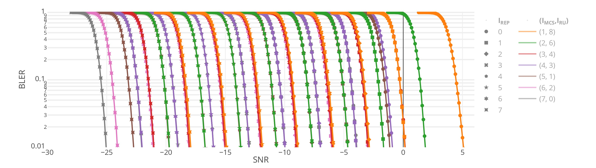
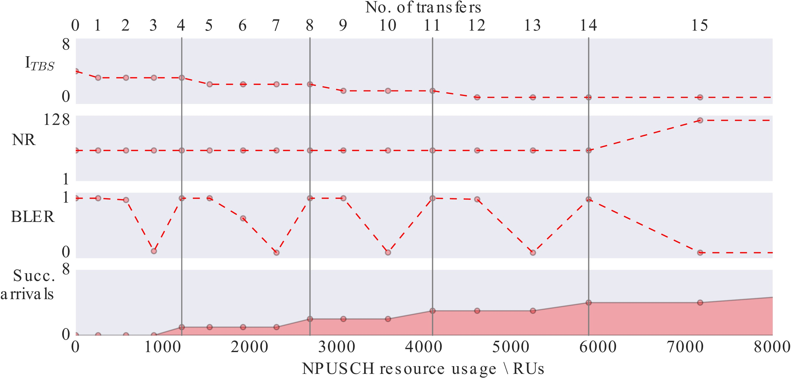

#
# Lite NBIoT NPUSCH Simulator

We developed a lite NB-IoT NPUSCH simulator based on two main simulation codes:  **NPUSCH-BLER-Sim** and **NPUSCH-Transmission-Sim**. This software was used in the references below to asses strategies for decreasing radio resource consumption.


## Scientific references

This code was explicitly used in the following scientific publications:

- E. Luján, J. A. Zuloaga Mellino, A. Otero, L. Rey Vega, C. Galarza, E. Mocskos. “NB-IoT: extreme-coverage resource optimization through uplink scheduling”. IEEE Internet of Things Journal. 2019.
- E. Luján, A. Otero, S. Valenzuela, E. Mocskos, L. A. Steffenel and S. Nesmachnow. “An integrated platform for smart energy management: the CC-SEM project”. Revista Facultad de Ingenieria. Universidad de Antioquia. 2019.
- J. A. Zuloaga Mellino, E. Luján, A. Otero, E. Mocskos, L. Rey Vega, C. Galarza. “Lite NB-IoT Simulator for Uplink Layer”. XVIII Workshop on Information Processing and Control. IEEE. 2019.
- E. Luján, A. Otero, S. Valenzuela, E. Mocskos, L. A. Steffenel and S. Nesmachnow. “Cloud Computing for Smart Energy Management (CC-SEM project)”. Communications in Computer and Information Science. Springer. Congreso Iberoamericano de Ciudades Inteligentes (ICSC-CITIES 2018). Soria, España. 2018.


## NPUSCH-BLER-Sim

- Simulation of the uplink layer based on the Matlab Toolkit module: Uplink Waveform Generation. The link layer model was implemented according to the NB-IoT physical uplink shared channel (NPUSCH) standard. Montecarlo simulations were performed over an AWGN channel in order to obtain block error rate (BLER) information for the different link layer configurations. The outcome of the simulation was used to trace BLER curves and obtain optimal link settings for target BLERs.

 
- Software requirements
    * python 2.7
    * MATLAB 2017b Engine API for Python
- Execution instructions
    ```
    cd "<matlabroot>/extern/engines/python"
    sudo python setup.py install
    cd NPUSCH-BLER-Sim
    python stepper.py 
    ```
- Output: stepper.py will create a table `BLERSIMU` within the sqlite3 file `test.db`, containing the following columns
    ```
    `imcs`, `iru`, `irep`, `isnr`, `finished`, `bler`, `snr`, `tbs`, `totru`
    ``` 
- In order to monitor the simulation state open a new terminal and type
    ```
    python monitor.py 
    ```

## NPUSCH-Transmission-Sim

- It models the uplink iterative sub-process, where the BS determines the (MCS,NR) tuple and sends this information to the UE.


- Software requirements
    - python 3
    - NPUSCH-BLER-Sim (needed for the LUT generation)
- Execution instructions
    ```
    cd NPUSCH-Sim/cases
    make
    ```
- Output: PDF files with information about
    - No. of resource units vs BLER
    - Scheduling algorithm performance comparation

